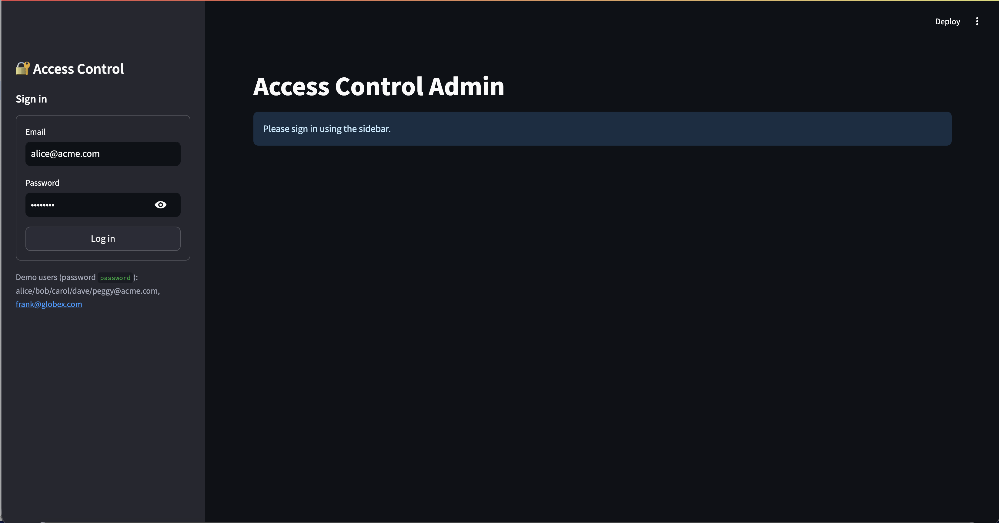
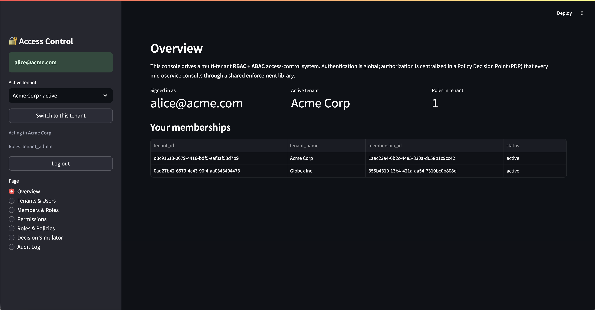
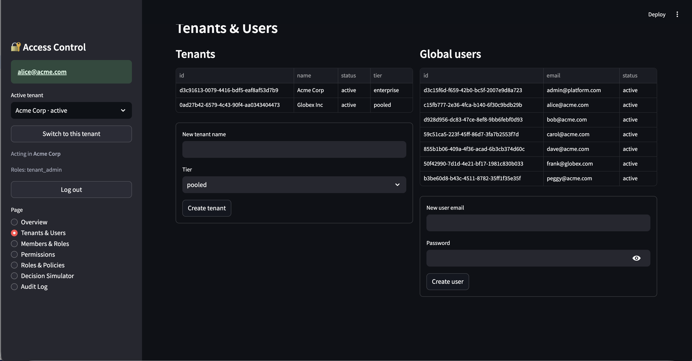
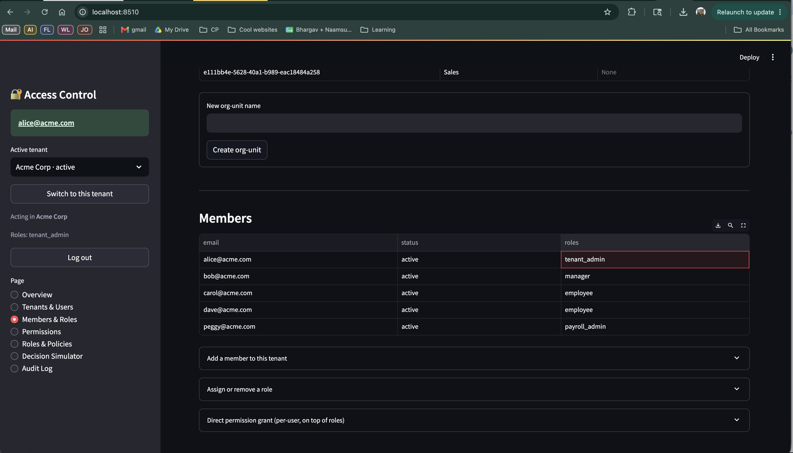
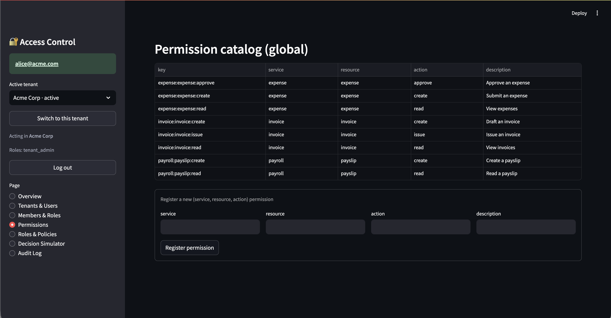
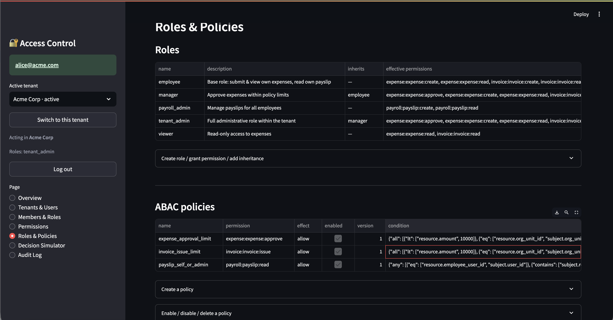
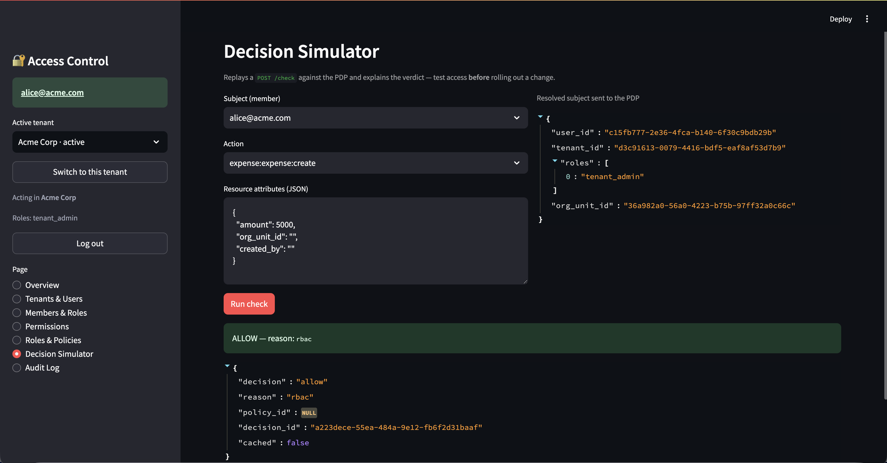
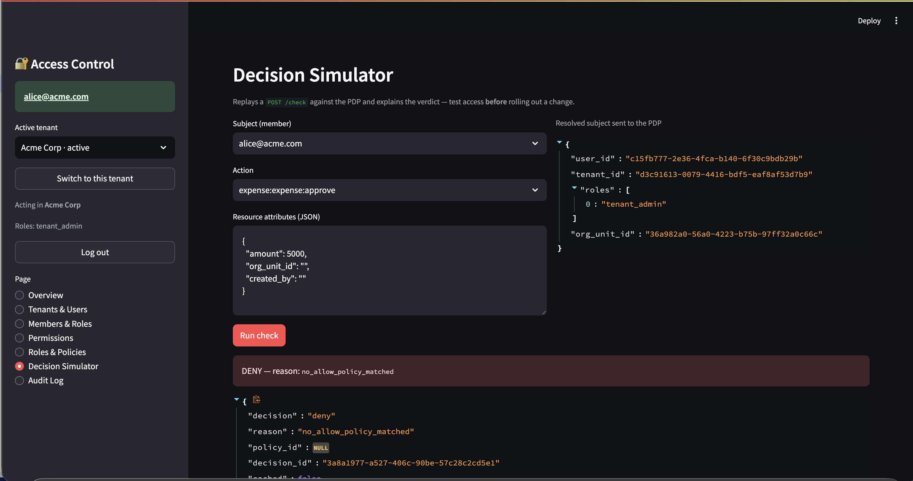
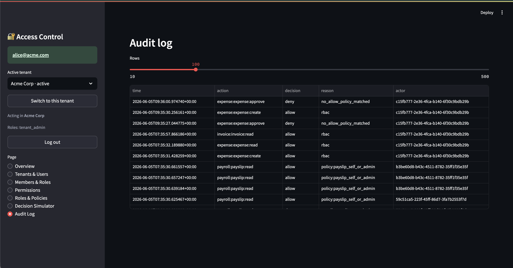

# Access Control Across Microservices in a Multi-Tenant Architecture

An enterprise-grade **access-control system** for a multi-tenant, microservices
SaaS platform. It answers one question consistently across every service:

> *Can subject **S**, acting in tenant **T**, perform action **A** on resource **R**
> (with attributes), under the current environment?*

— with strong tenant isolation, hybrid **RBAC + ABAC**, full auditability, and a
decision cache for low-latency enforcement at scale.

📑 **Submission index (start here):** [`docs/README.md`](docs/README.md) — maps every required deliverable to its file
📐 **Full design & rationale:** [`docs/DESIGN.md`](docs/DESIGN.md)
🖼 **Architecture, sequence & schema diagrams:** [`docs/diagrams/`](docs/diagrams/README.md)
🔌 **API reference with curl examples:** [`docs/api-examples.md`](docs/api-examples.md)
🔎 **File-by-file code walkthrough:** [`docs/CODE-WALKTHROUGH.md`](docs/CODE-WALKTHROUGH.md)

---

## Architecture at a glance

```
                       ┌────────────────┐
   Streamlit Admin UI ─┤                │
                       │   Auth (8001)  │  global identity, JWTs, memberships
   curl / clients ─────┤                │
                       └──────┬─────────┘
                              │ tenant-scoped access JWT
        ┌─────────────────────┼──────────────────────┐
        │                     │                       │
 ┌──────▼───────┐      ┌──────▼───────┐        ┌──────▼──────┐
 │ Expense(8003)│      │ Payroll(8004)│        │  any svc    │
 │   + PEP      │      │   + PEP      │        │   + PEP     │
 └──────┬───────┘      └──────┬───────┘        └──────┬──────┘
        │  POST /check (service JWT + user subject)   │
        └─────────────────────┼──────────────────────┘
                       ┌───────▼────────┐
                       │  Authz / PDP   │  RBAC graph + ABAC engine, policy CRUD,
                       │     (8002)     │  audit, version-keyed decision cache
                       └───┬────────┬───┘
                           │        │
                    ┌──────▼──┐  ┌──▼───────┐
                    │ Postgres│  │  Redis   │  shared DB + Row-Level Security;
                    │  + RLS  │  │ cache +  │  decision cache + refresh sessions
                    └─────────┘  │ sessions │
                                 └──────────┘
```

- **Auth** owns identity: global users, tenants, **memberships** (a user's
  participation in one tenant), and issues tenant-scoped access JWTs.
- **Authz (PDP/PAP)** is the brain — resolves the role graph, evaluates ABAC
  policies (a safe JSON DSL, no `eval`), writes audit, caches decisions.
- **PEP** (`libs/pep`) is the thin enforcement library every business service
  imports: validate JWT → enforce tenant → ask the PDP → allow / 403.
- **Expense** demonstrates ABAC (amount threshold, same org-unit,
  separation-of-duties); **Payroll** demonstrates sensitive-data RBAC + per-row
  self-access; **Invoice** is a third sample proving a new service plugs in with
  zero core changes (imports the PEP, registers `invoice:*`, attaches a policy).
- **Postgres RLS** is the last line of tenant isolation — even a buggy query
  cannot cross tenants.

---

## Quickstart

Requires Docker + Docker Compose.

```bash
make up        # build, start Postgres/Redis + all services, run bootstrap + seed
make e2e       # run the end-to-end cross-service access-control test
```

| Surface | URL |
|---|---|
| **Admin UI (Streamlit)** | http://localhost:8510 |
| Auth service | http://localhost:8001/docs |
| Authz service (PDP/PAP) | http://localhost:8002/docs |
| Expense service | http://localhost:8003/docs |
| Payroll service | http://localhost:8004/docs |
| Invoice service | http://localhost:8005/docs |

> The UI is mapped to **8510** (the conventional 8501 was occupied on the build
> machine). Change the `ui` port in `docker-compose.yml` if you prefer 8501.

### Demo logins (password = `password` for all demo users)

| User | Acme Corp | Globex Inc |
|---|---|---|
| `alice@acme.com` | `tenant_admin` | `viewer` *(same identity, different roles — multi-tenant)* |
| `bob@acme.com` | `manager` (Engineering) | — |
| `carol@acme.com` | `employee` (Engineering) + direct `expense:approve` grant | — |
| `dave@acme.com` | `employee` (Sales) | — |
| `peggy@acme.com` | `payroll_admin` | — |
| `frank@globex.com` | — | `tenant_admin` |

`admin@platform.com` / `admin` is the global platform admin.

---

## Screenshots

The Streamlit admin console ([`docs/screenshots/`](docs/screenshots)) — drives the whole system
through the public APIs (manage tenants/users/roles/policies, simulate decisions, view the audit log).

| | |
|---|---|
| **Login** — global identity, then pick the active tenant | **Overview** — signed-in context + memberships |
|  |  |
| **Tenants & Users** — global users, multi-tenant memberships | **Members & Roles** — org-units, role assignment |
|  |  |
| **Permissions** — the global `(service, resource, action)` catalog | **Roles & Policies** — inheritance + ABAC policies |
|  |  |
| **Decision Simulator — ALLOW** — replays `POST /check`, explains the verdict | **Decision Simulator — DENY** — same, denied with a reason |
|  |  |
| **Audit log** — every decision + admin change, with reason | |
|  | |

---

## What the demo proves

Run `make e2e` (or click through the UI's **Decision Simulator**) to see:

| Scenario | Expected |
|---|---|
| Employee submits an expense | **allow** (RBAC) |
| Employee tries to approve | **deny** — `no_permission` |
| Manager approves a $4k same-dept expense (not their own) | **allow** (ABAC matches) |
| Manager approves a $50k expense | **deny** — over amount threshold |
| Manager approves another dept's expense | **deny** — org-unit mismatch |
| Manager approves their **own** expense | **deny** — separation of duties |
| Employee reads their own payslip | **allow** (self-access) |
| Employee reads someone else's payslip | **deny** |
| `payroll_admin` reads any payslip / lists all | **allow** |
| A tenant token reading another tenant's row | **404 / denied** (RLS) |
| Same identity, `viewer` in Globex, tries to create | **deny** (per-tenant roles) |
| Repeated identical check | second is **cached** |

---

## Useful commands

```bash
make up         # start everything (build + bootstrap + seed)
make e2e        # end-to-end access-control test (exits non-zero on failure)
make seed       # re-load demo data (idempotent)
make bootstrap  # re-apply schema + roles + RLS policies
make logs       # tail all logs   (make logs-authz for one service)
make ps         # service status
make db-shell   # psql as superuser
make reset      # wipe volumes and rebuild from scratch
make down       # stop
```

---

## Project layout

```
services/
  common/        config, db (RLS-aware sessions), models, security, cache,
                 bootstrap (schema + roles + RLS), seed (demo data)
  auth/          identity authority — login, tenant select/switch, mgmt
  authz/         PDP + PAP — engine.py (RBAC graph + ABAC DSL), /check, CRUD, audit
  expense/       sample service — ABAC enforcement via the PEP
  payroll/       sample service — sensitive-data RBAC + per-row authorization
  invoice/       sample service — proves a NEW service plugs in with zero core changes
libs/pep/        shared Policy Enforcement Point (FastAPI dependency + client)
ui/              Streamlit admin console (manage + simulate + audit)
scripts/e2e.py   end-to-end cross-service test
docs/            README.md (submission index), DESIGN.md, api-examples.md,
                 CODE-WALKTHROUGH.md, ZANZIBAR-VS-XACML.md, diagrams/
```

---

## Implementation notes

- **Tokens:** identity token (post-login, pre-tenant) → tenant-scoped access
  token (carries one `tenant_id` + roles) → service token (service-to-service).
- **Two DB roles:** `app_user` (RLS **enforced**, used by Authz/Expense/Payroll)
  and `identity_user` (`BYPASSRLS`, used only by Auth, which legitimately spans
  tenants). Bootstrap creates both and installs the `tenant_isolation` policy on
  every table carrying `tenant_id`.
- **Cache correctness:** the decision cache key includes a per-tenant *authz
  epoch* bumped on any role/permission/policy change, so edits take effect within
  the TTL without stale grants.
- **Deny by default, explicit deny wins.** ALLOW policies are additive
  constraints on an RBAC grant; DENY policies are subtractive and always win.

See [`docs/DESIGN.md`](docs/DESIGN.md) for the assumptions, tradeoffs, scaling
strategy, and the full requirements-traceability matrix.
