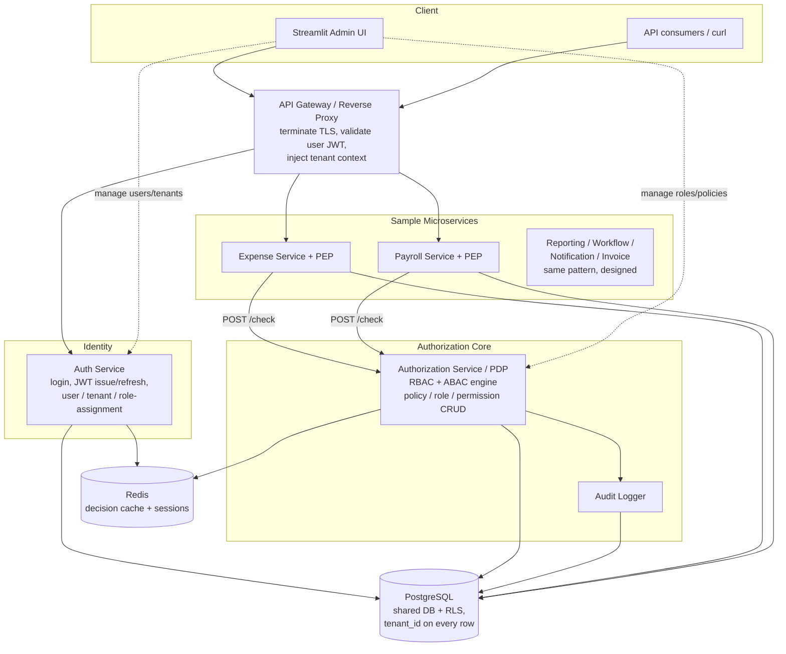
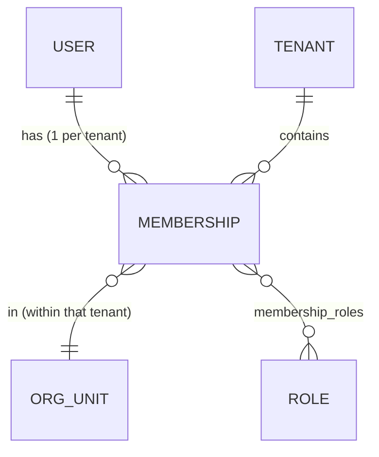
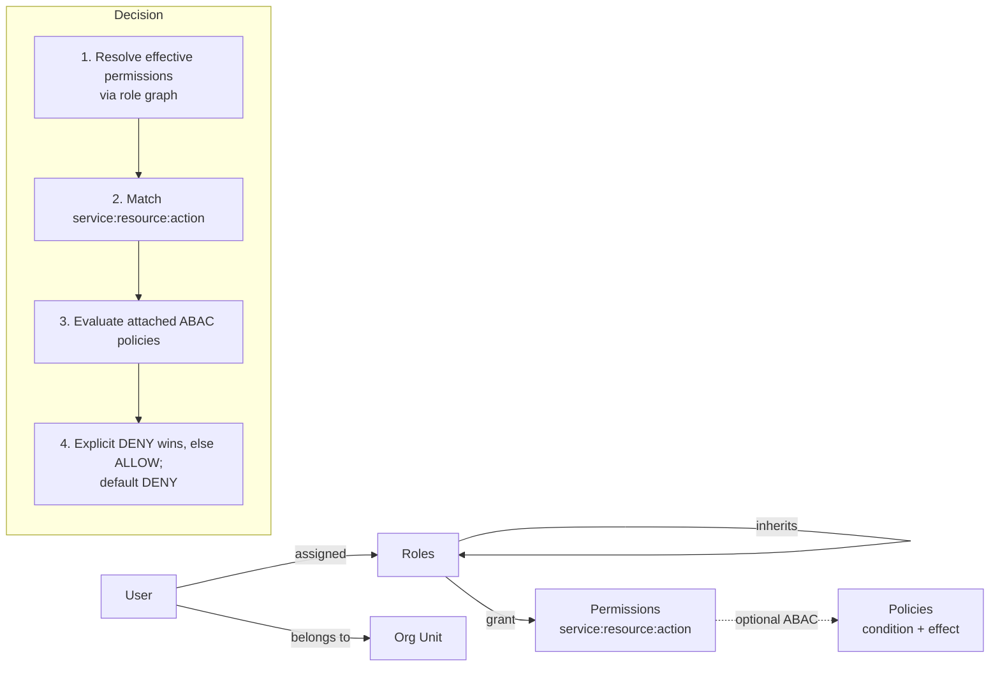
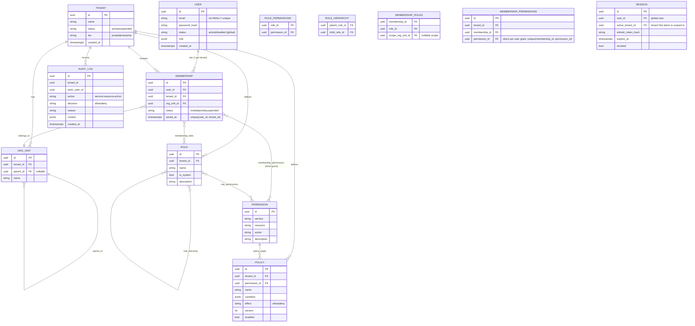
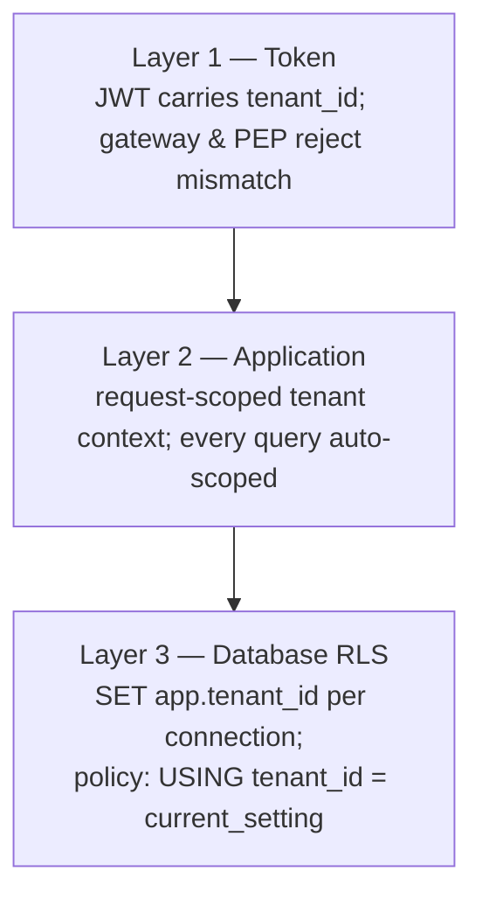
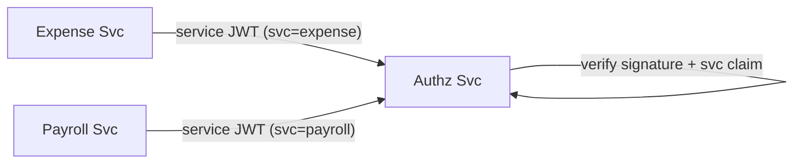

# Access Control Across Microservices in a Multi-Tenant Architecture — Design Document

> Enterprise-grade Access Control System for a multi-tenant, microservices-based SaaS platform.

> 🖼 All diagrams below are also available as standalone, rendered images (SVG/PNG) in
> [`docs/diagrams/`](./diagrams/README.md) — regenerate with `make diagrams`.

---

## Table of Contents

1. [Overview & Scope](#1-overview--scope)
2. [Assumptions](#2-assumptions)
3. [Functional Requirements](#3-functional-requirements)
4. [Non-Functional Requirements](#4-non-functional-requirements)
5. [High-Level Architecture](#5-high-level-architecture)
6. [Access Control Model (RBAC + ABAC)](#6-access-control-model-rbac--abac)
7. [Data Model & Schema](#7-data-model--schema)
8. [Authentication & Authorization Flow](#8-authentication--authorization-flow)
9. [Multi-Tenant Isolation Strategy](#9-multi-tenant-isolation-strategy)
10. [Service-to-Service Security](#10-service-to-service-security)
11. [APIs](#11-apis)
12. [Scalability & Reliability](#12-scalability--reliability)
13. [Security & Compliance](#13-security--compliance)
14. [Operational Concerns](#14-operational-concerns)
15. [Key Tradeoffs & Alternatives Considered](#15-key-tradeoffs--alternatives-considered)
16. [Requirements Traceability Matrix](#16-requirements-traceability-matrix)
17. [Future Evolution](#17-future-evolution)

---

## 1. Overview & Scope

We design and (partially) implement an **Access Control System** that sits at the heart of a multi-tenant SaaS platform composed of independent microservices (User Management, Expense, Payroll, Reporting, Workflow, Notification, Invoice). The system answers one central question consistently across every service:

> **"Can subject `S`, acting in tenant `T`, perform action `A` on resource `R` (with attributes), under the current environment?"**

It must do this with strong tenant isolation, fine-grained rules, full auditability, and at a scale of **thousands of tenants / millions of users / high throughput**.

### What is built as runnable code (reference implementation)

| Component | Built | Purpose |
|---|---|---|
| **Auth Service** | ✅ | Authentication, JWT issuance/refresh, user/tenant/role-assignment management |
| **Authorization Service (PDP)** | ✅ | Policy Decision Point: RBAC + ABAC evaluation, role/permission/policy CRUD, audit |
| **Shared PEP library** | ✅ | Policy Enforcement Point middleware imported by each microservice |
| **Expense Service** | ✅ | Sample service demonstrating **ABAC** (amount thresholds, dept ownership, separation of duties) |
| **Payroll Service** | ✅ | Sample service demonstrating **sensitive-data RBAC** + tenant isolation |
| **Streamlit Admin UI** | ✅ | Manage tenants, users, roles, permissions, policies; live decision simulator; audit viewer |
| **PostgreSQL (+RLS) & Redis** | ✅ | Shared DB with row-level security; decision cache + session store |
| Reporting / Workflow / Notification / Invoice | ⛔ Designed only | They generalize identically to the two sample services; documented, not coded, to fit the timebox |

This is a deliberate scope decision: **two well-chosen sample services prove the entire cross-service authorization story**; the remaining services are structurally identical (import the same PEP, register their permissions, attach policies).

---

## 2. Assumptions

1. **Tenant = Organization.** One company = one tenant. **A user is a global identity that can belong to many tenants** (the Slack/Google/Atlassian pattern): identity/credentials are global, while *participation* in a tenant is a **Membership** that carries that tenant's roles and org-unit. A user always acts within **one active tenant at a time** (the token is tenant-scoped). See [§6.1](#61-multi-tenant-membership-identity-vs-participation) and [§9](#9-multi-tenant-isolation-strategy).
2. **Identity is internal** for the reference implementation (email + password). Enterprise SSO (OIDC/SAML/SCIM) is designed for but stubbed; the JWT contract is identical regardless of IdP.
3. **Scale target** drives design but is not load-tested in the take-home: ~10⁴ tenants, ~10⁶ users, ~10³–10⁴ authz checks/sec at peak.
4. **Postgres** is the system of record. **Redis** is a cache/session store (loss-tolerant).
5. **Trust boundary:** the API gateway terminates external TLS and validates the user JWT; internal service-to-service calls are within a trusted network and additionally use signed service tokens.
6. **Eventual revocation is acceptable within a small bound** (cache TTL, default 15s). Truly instant revocation is available via cache-busting (documented).
7. **2-day build budget** — favors clarity and correctness of the core model over breadth of services.

---

## 3. Functional Requirements

### Identity & Tenancy
- **FR-1** Create/manage tenants (organizations), each with status (`active`/`suspended`) and tier (`pooled`/`enterprise`).
- **FR-2** Manage **global users** (a user is one identity that may belong to multiple tenants) and **memberships** (a user's participation in a tenant, with an org-unit assignment in that tenant's hierarchy). An admin adds an existing/new user to their tenant as a member.
- **FR-3** Authenticate the **global identity** (email + password), then **select/switch the active tenant** → a tenant-scoped JWT; refresh and revoke sessions.

### Access Control
- **FR-4** Define **permissions** as `(service, resource, action)` triples (e.g. `expense:expense:approve`).
- **FR-5** Define **roles** per tenant; grant permissions to roles; support **role inheritance** (hierarchy).
- **FR-6** Assign roles to a user's **membership** in a tenant (many-to-many) — so the same user can hold different roles in different tenants.
- **FR-7** Define **ABAC policies**: a condition (over subject/resource/environment attributes) + effect (`allow`/`deny`) attached to permissions.
- **FR-8** Evaluate a decision: `check(subject, action, resource)` → `allow|deny` with a **reason**.
- **FR-9** **Dynamic management**: role/permission/policy changes take effect without redeploys and within the cache TTL.
- **FR-10** **System roles** (e.g. `tenant_admin`) seeded per tenant; org-unit-scoped role assignments.

### Cross-cutting
- **FR-11** Every privileged action and every authorization decision is **audited** (who, what, when, decision, reason).
- **FR-12** Admin **UI** to perform all of the above and to **simulate** a decision before rolling it out.
- **FR-13** Cross-service authorization: any service can ask the PDP and get a consistent answer.

---

## 4. Non-Functional Requirements

| # | Requirement | Target / Approach |
|---|---|---|
| NFR-1 | **Tenant isolation** | No tenant can read/affect another's data — enforced at JWT, app, and Postgres-RLS layers (defense in depth). |
| NFR-2 | **Low-latency authz** | p99 `check` < 10 ms on cache hit; PDP call only on cache miss. |
| NFR-3 | **High throughput** | Stateless, horizontally scalable services; shared Redis decision cache; read-optimized permission resolution. |
| NFR-4 | **Availability** | No single hard dependency on the PDP hot path (cache + fail-safe defaults). Target 99.9%. |
| NFR-5 | **Auditability/Compliance** | Append-only audit log; immutable decision records; supports SOC2/GDPR-style review. |
| NFR-6 | **Security** | Deny-by-default; explicit-deny-wins; least privilege; signed tokens; hashed secrets. |
| NFR-7 | **Consistency of decisions** | One decision engine (the PDP) — every service gets identical semantics. |
| NFR-8 | **Operability** | Structured logs, health checks, metrics, traceable decision IDs. |
| NFR-9 | **Extensibility** | New service = register permissions + import PEP; no core change. |

---

## 5. High-Level Architecture



### Component responsibilities

- **API Gateway** — single ingress; terminates TLS, validates the user JWT signature/expiry, extracts `tenant_id`, routes to services. (In the reference impl this is a thin layer; in production: Kong/Envoy/APISIX.)
- **Auth Service** — owns identity: tenants, **global users**, **memberships** (user↔tenant), credentials, sessions, role *assignments*. Authenticates the global identity and issues tenant-scoped JWTs (login → select/switch-tenant). Does **not** make authorization decisions.
- **Authorization Service (PDP)** — the brain. Owns roles, permissions, policies. Exposes `POST /check`. Resolves the role graph, evaluates ABAC conditions, writes audit, returns `{decision, reason, policy_id}`. This is also the **PAP** (Policy Administration Point) — CRUD for the access model.
- **PEP (shared library)** — imported by every business service. A FastAPI dependency that (1) validates the JWT, (2) enforces tenant match, (3) consults Redis decision cache, (4) on miss calls the PDP, (5) allows/denies the request. **Enforcement is distributed; decision-making is centralized.**
- **Business services** — own their domain data (expenses, payslips); delegate *all* access decisions to the PEP/PDP.
- **PostgreSQL** — single shared database; `tenant_id` on every business/identity row; **Row-Level Security** as the last line of defense.
- **Redis** — decision cache (key = hash of subject+action+resource+policy-version) and session/refresh-token store.

### Why this shape (the central tradeoff resolved)

We separate **authentication** (JWT, slow-changing identity → in the token, zero network calls) from **authorization** (fine-grained, resource-dependent, dynamic → the PDP service, with a decision cache). This gives **token-level speed on the hot path** while preserving **service-level correctness** (instant-ish revocation, ABAC on live resource attributes, full audit). See [§15](#15-key-tradeoffs--alternatives-considered).

---

## 6. Access Control Model (RBAC + ABAC)

We use a **hybrid RBAC + ABAC** model.

- **RBAC** answers *"what is this user generally allowed to do?"* — coarse, role-driven, cacheable, easy to reason about and administer.
- **ABAC** answers *"...but only if these conditions about the specific resource/context hold?"* — fine-grained, dynamic, expressed as policies.

### 6.1 Multi-tenant membership: identity vs participation

A **user is a global principal**; a **membership** is that user's participation in a single tenant. Roles are tenant-scoped, so they attach to the *membership*, not the user — letting one person be `admin` in Tenant A and `viewer` in Tenant B.



- **User (Principal)** — global identity: `email` (globally unique), credentials/MFA, global `status`. Tenant-independent. *Authentication* is global.
- **Membership** — `(user_id, tenant_id, org_unit_id, status)`, unique per `(user, tenant)`; status `invited|active|suspended` is **independent per tenant** (suspended in A, active in B).
- **One active tenant at a time** — the access token always carries exactly **one** `tenant_id`. Switching tenants re-issues a token. This keeps the PDP and Postgres-RLS design **completely unchanged** — they always see a single tenant context.
- **Isolation is not weakened** — a token can only ever name a tenant where the user has an *active* membership, re-verified at every issuance/switch; a user can never set the RLS context to a tenant they don't belong to.
- **Adding a member** (in scope): an admin adds an existing-or-new user to their tenant, creating an `active` membership directly. Full invitation/accept emails, self-service domain-join, SSO JIT provisioning, and per-tenant identity linking are deliberately deferred ([§17](#17-future-evolution)).
- **Cross-tenant platform admin** is a distinct concept (a global principal with platform-level grants), modeled deliberately rather than as a side effect of membership — also future work.



### Core concepts

- **Permission** — a `(service, resource, action)` triple, e.g. `expense:expense:approve`, `payroll:payslip:read`. Global catalog (not tenant-scoped) so semantics are uniform; tenants grant subsets via roles.
- **Role** — a tenant-scoped named bundle of permissions. Roles can **inherit** other roles (`manager` inherits `employee`), forming a DAG that also models organizational seniority.
- **Org Unit** — node in the tenant's org tree (Company → Dept → Team). A *membership* belongs to one (so the same user can sit in different org units across tenants). Used by ABAC (`resource.dept == subject.dept`) and for scoped role assignments.
- **Policy (ABAC)** — `{ condition, effect }` attached to a permission. The condition is a small JSON boolean expression over `subject.*`, `resource.*`, `environment.*` attributes. Effect is `allow` or `deny`.
- **Direct grant (per-user)** — a permission attached **directly to a membership** (`membership_permissions`), in addition to whatever its roles grant. The effective permission set at decision time is *roles (incl. inheritance) **∪** direct grants*. This is the supported way to give one user one extra permission without inventing a single-member role; it only **widens** the RBAC gate — ABAC deny policies still run afterwards and take priority, so a direct grant can never override an explicit deny. Like roles, direct grants are tenant-scoped (RLS) and changing them bumps the tenant authz epoch (cache invalidation).

### Condition language (JSON DSL)

A minimal, safe, serializable expression tree — **no arbitrary code execution** (unlike raw Rego/eval):

```json
{ "all": [
    { "lt":  ["resource.amount", 10000] },
    { "eq":  ["resource.dept_id", "subject.dept_id"] },
    { "neq": ["resource.created_by", "subject.user_id"] }
]}
```

Supported operators: `all` (AND), `any` (OR), `not`, `eq`, `neq`, `lt`, `lte`, `gt`, `gte`, `in`, `contains`. Operands are either literals or dotted attribute paths resolved from the request context. This keeps ABAC **expressive enough** for real enterprise rules while remaining **auditable, cacheable, and injection-safe**.

### Decision algorithm (PDP)

```
decision(subject, action_triple, resource_attrs, env):
    1. effective_perms = resolve_role_graph(subject.roles)      # transitive closure
                       ∪ direct_grants(subject.user)            # per-user membership_permissions
    2. if action_triple not in effective_perms: return DENY("no_permission")
    3. policies = enabled_policies_for(action_triple, subject.tenant)
    4. if any DENY policy evaluates true: return DENY(policy)   # explicit deny wins
    5. if ALLOW policies exist for this permission:
          - allow if any of them matches, else DENY("no_allow_policy_matched")
    6. else (no ALLOW policies attached): return ALLOW("rbac")  # RBAC baseline grant
```

**Semantics note:** ALLOW-policies act as *additive constraints* on an RBAC-granted
permission — if any exist, at least one must match. DENY-policies are *subtractive*
and always win. This makes "RBAC grants the capability; ABAC narrows it" precise,
and avoids a lone non-matching DENY-policy silently revoking a valid RBAC grant.

**Auditing:** the PDP records every *decision computation* (i.e. on a cache miss)
to `audit_log`. Per-request *access* logging (including cache hits) is the
PEP/gateway's structured log — separating "decision events" from "request volume"
keeps the cache valuable without losing the decision trail.

**Worked examples (Expense service):**
- *Employee submits an expense* → has `expense:create` via `employee` role → **ALLOW** (RBAC only).
- *Manager approves a $5k expense in their own dept, not their own* → has `expense:approve`; policy `amount<10000 AND same dept AND approver≠creator` → **ALLOW**.
- *Manager approves a $50k expense* → permission present but ABAC `amount<10000` fails → **DENY** (reason = policy id). Demonstrates fine-grained control beyond roles.
- *Manager tries to approve their own expense* → separation-of-duties `neq(created_by, user_id)` fails → **DENY**.
- *Employee with a **direct** `expense:approve` grant approves a colleague's $5k same-dept expense* → permission present via `membership_permissions` (not a role); ABAC `expense_approval_limit` matches → **ALLOW**. The same employee approving *their own* expense still → **DENY** (separation-of-duties): the direct grant widens the gate, ABAC still narrows it.

---

## 7. Data Model & Schema

`USER` is **global** (no `tenant_id`); all tenant-scoped tables carry `tenant_id` and are protected by RLS. The `permissions` catalog is global. A user's link to a tenant is the `MEMBERSHIP` row, which carries that tenant's roles and org-unit.



**Notes**
- `USER` is **global** (no `tenant_id`); `MEMBERSHIP` is the only bridge to a tenant. Email is globally unique. A user with no active membership for a tenant can never obtain a token scoped to it.
- `permissions` is a **global catalog** (not tenant-scoped) → uniform semantics across tenants; new services insert their permission rows at startup (idempotent).
- A per-tenant **authz epoch** (a counter in Redis, bumped on any role/permission/policy change) is included in the **decision cache key**. A single change invalidates *all* cached decisions for that tenant instantly — covering RBAC changes too, not just policy edits. (`policy.version` is additionally kept on each policy row for history/optimistic updates.)
- `membership_roles.scope_org_unit_id` enables **scoped grants** (e.g. "manager of Engineering only"); roles are per-membership, so the same user can hold different roles in different tenants.
- `membership_permissions` is the **direct per-user grant** path: a permission attached straight to a membership, unioned with role-derived permissions at decision time. It lets you give one user one extra permission without minting a single-member role; ABAC deny still overrides it. Tenant-scoped (RLS) and epoch-bumped on change like every other authz mutation.
- `session.active_tenant_id` records which tenant a refresh session is scoped to; switching tenants issues a new scoped session.
- `audit_log` is append-only (no UPDATE/DELETE grants); partitioned by month at scale.

---

## 8. Authentication & Authorization Flow

```mermaid
sequenceDiagram
    autonumber
    participant U as User / UI
    participant GW as API Gateway
    participant A as Auth Service
    participant E as Expense Svc (PEP)
    participant P as Authz Svc (PDP)
    participant C as Redis
    participant DB as Postgres

    Note over U,A: Authentication (global identity)
    U->>GW: POST /auth/login {email, pwd}
    GW->>A: forward
    A->>DB: verify global credentials
    A->>DB: load memberships; pick PRIMARY (first-joined) active membership
    A->>C: store refresh session for the primary tenant
    A-->>U: identity token + memberships + access JWT auto-scoped to primary tenant
    Note over U,A: Switch tenant only when acting elsewhere (login already scoped)
    U->>GW: POST /auth/switch-tenant {tenant_id} (Bearer identity/access token)
    GW->>A: forward
    A->>DB: verify ACTIVE membership(user, tenant), load roles for that membership
    A->>C: store refresh session (active_tenant_id)
    A-->>U: access JWT {user_id, tenant_id, roles, membership_id, exp=15m} + refresh token

    Note over U,P: Authorization (per request)
    U->>GW: POST /expenses/{id}/approve (Bearer JWT)
    GW->>GW: validate JWT sig + exp, extract tenant_id
    GW->>E: forward + tenant context
    E->>E: PEP: re-validate JWT, assert tenant match
    E->>DB: load resource attrs (amount, dept, created_by)
    E->>C: GET decision cache [hash(sub,action,res,policy_ver)]
    alt cache hit
      C-->>E: allow|deny
    else cache miss
      E->>P: POST /check {subject, action, resource_attrs, env}
      P->>DB: resolve role graph + attached policies (RLS scoped)
      P->>P: RBAC match -> ABAC eval -> deny-by-default
      P->>DB: append audit_log
      P-->>E: {decision, reason, policy_id}
      E->>C: SET cache (TTL 15s)
    end
    alt allow
      E->>DB: perform approval
      E-->>U: 200 OK
    else deny
      E-->>U: 403 {reason}
    end
```

**Identity token (post-login, pre-tenant-selection)** — minimal; only authorizes `/auth/select-tenant`, `/auth/switch-tenant`, `/auth/me`:
```json
{ "sub": "user-uuid", "type": "identity", "iat": 1733300000, "exp": 1733300600 }
```

**Access token (tenant-scoped, issued by select/switch-tenant):**
```json
{
  "sub": "user-uuid",
  "tenant_id": "tenant-uuid",
  "membership_id": "mbr-uuid",
  "roles": ["manager", "employee"],
  "org_unit_id": "ou-uuid",
  "type": "access",
  "iat": 1733300000,
  "exp": 1733300900
}
```
The access token always carries **exactly one** `tenant_id` (the active tenant) — a multi-tenant user gets a fresh token per tenant via `switch-tenant`. Permissions are **not** baked in — only stable identity + roles. Fine-grained permission/policy resolution happens at the PDP so changes are dynamic and revocable.

---

## 9. Multi-Tenant Isolation Strategy

**Chosen: Shared database, shared schema, `tenant_id` discriminator + PostgreSQL Row-Level Security.** Defense in depth across three layers:



1. **Token layer** — `tenant_id` is a signed claim; the PEP rejects any request whose JWT tenant ≠ the resource's tenant.
2. **Application layer** — each request opens a DB session and executes `SET app.current_tenant = '<tenant_id>'`; ORM models include `tenant_id` and queries are scoped via a shared mixin.
3. **Database layer (the safety net)** — every table has an RLS policy:
   ```sql
   ALTER TABLE expenses ENABLE ROW LEVEL SECURITY;
   CREATE POLICY tenant_isolation ON expenses
     USING (tenant_id = current_setting('app.current_tenant')::uuid);
   ```
   Even an application bug (forgotten `WHERE tenant_id=`) **physically cannot** leak another tenant's rows, because Postgres filters them.

**Why not schema-per-tenant or DB-per-tenant?** They give stronger physical isolation but don't scale operationally to thousands of tenants (migrations across thousands of schemas, connection-pool fan-out). RLS gives strong logical isolation at the right cost for this scale. The design supports a **tiered upgrade**: premium/`enterprise`-tier tenants can be siloed into a dedicated DB later (`tenant.tier` field already present) without changing application code — the tenant context just points at a different connection.

**Cross-tenant access = automatic deny + audit.** There is no code path that grants it.

**Multi-tenant users do not weaken this.** A user belonging to many tenants still acts under a token scoped to exactly one active tenant, and that token is only ever issued after re-verifying an *active* membership. The RLS context (`app.current_tenant`) is derived from the token's `tenant_id`, so a multi-tenant user has no way to read another tenant's data — switching tenants requires a fresh token and a fresh membership check.

---

## 10. Service-to-Service Security



- Each service holds a **client credential** and obtains a **short-lived service JWT** (claim `svc`, e.g. `expense`) to call the PDP. The PDP verifies the signature and that the caller is a known service before trusting the forwarded user context.
- **Two distinct identities per request**: the *service* (caller) and the *user* (subject) — the PDP authorizes the user, while authenticating the service.
- **Production upgrade (documented):** mTLS between services via a service mesh (Istio/Linkerd) and SPIFFE/SPIRE workload identities; network policies restricting who may call the PDP. The reference impl uses signed service tokens as a lighter equivalent that demonstrates the same trust model.
- **Token hygiene:** short TTLs, key rotation via a JWKS endpoint, no long-lived shared secrets in business services.

---

## 11. APIs

### Auth Service
| Method | Path | Purpose |
|---|---|---|
| POST | `/auth/login` | Authenticate **global identity** → identity token + list of memberships |
| POST | `/auth/select-tenant` | Pick active tenant → **tenant-scoped** access + refresh tokens |
| POST | `/auth/switch-tenant` | Re-issue a scoped token for a different tenant the user belongs to |
| GET | `/auth/me` | Current identity + memberships |
| POST | `/auth/refresh` | Exchange refresh token for new access token |
| POST | `/auth/logout` | Revoke session |
| POST | `/tenants` | Create tenant |
| POST | `/users` | Create a **global** user (identity only) |
| POST | `/tenants/{id}/members` | Add a user to this tenant → `active` membership (admin "add member") |
| POST | `/memberships/{id}/roles` | Assign role to a membership (optionally org-scoped) |

### Authorization Service (PDP + PAP)
| Method | Path | Purpose |
|---|---|---|
| POST | `/check` | **Decision endpoint**: `{subject, action, resource, env}` → `{decision, reason, policy_id}` |
| GET/POST | `/permissions` | List / register permissions (global catalog) |
| GET/POST/PUT/DELETE | `/roles` | Manage roles + role→permission grants + inheritance |
| GET/POST/PUT/DELETE | `/policies` | Manage ABAC policies |
| GET | `/audit` | Query audit log (tenant-scoped) |

**Example `POST /check`:**
```json
// request
{
  "subject":  { "user_id": "u1", "tenant_id": "t1", "roles": ["manager"], "dept_id": "d1" },
  "action":   "expense:expense:approve",
  "resource": { "amount": 5000, "dept_id": "d1", "created_by": "u2" },
  "environment": { "ip": "10.0.0.4", "time": "2026-06-04T10:00:00Z" }
}
// response
{ "decision": "allow", "reason": "policy:expense_approval_v3", "decision_id": "dec-abc", "cached": false }
```

### Business services (illustrative — Expense)
| Method | Path | Guarded by |
|---|---|---|
| POST | `/expenses` | `expense:expense:create` |
| POST | `/expenses/{id}/approve` | `expense:expense:approve` + ABAC |
| GET | `/expenses` | `expense:expense:read` (auto tenant-scoped) |

Full request/response examples live in [`docs/api-examples.md`](./api-examples.md).

---

## 12. Scalability & Reliability

**Throughput / latency**
- All services are **stateless** → scale horizontally behind the gateway.
- **Decision cache** (Redis) absorbs repeated checks; key includes `policy.version` so it's both fast and correct. p99 < 10 ms on hit.
- Permission resolution is read-heavy and cache-friendly; role graphs are small and can be memoized per request.
- Postgres scaled via read replicas for `check`/audit reads; connection pooling (PgBouncer).

**Reliability**
- **Fail-safe defaults:** if the PDP is unreachable on a cache miss, the PEP **denies** (secure default) for sensitive actions; a configurable fail-open is available only for explicitly low-risk read endpoints.
- **No SPOF on the hot path:** cache hits don't touch the PDP; PDP runs N replicas.
- **Graceful degradation:** Redis down → fall back to direct PDP calls (slower, still correct).
- **Audit durability:** decisions are written before the response is returned for privileged actions.

**Scaling the data tier**
- `audit_log` partitioned by month + archived to cold storage.
- Tiered isolation: heavy `enterprise` tenants siloed to dedicated DBs to remove noisy-neighbor risk.

---

## 13. Security & Compliance

- **Deny by default; explicit deny wins.** No implicit grants anywhere.
- **Least privilege:** users get roles, roles get minimal permissions, ABAC narrows further.
- **Credential security:** passwords hashed (bcrypt/argon2); refresh tokens stored hashed; access tokens short-lived (15m).
- **Token security:** signed JWT (asymmetric in prod via JWKS), audience/issuer checks, tenant-claim binding.
- **Injection-safe ABAC:** JSON DSL evaluated by a safe interpreter — **no `eval`/Rego sandbox-escape surface**.
- **Audit & compliance:** append-only, immutable audit trail of every decision and admin change → supports SOC 2, ISO 27001, GDPR access reviews. Each decision has a `decision_id` for traceability.
- **Data isolation:** RLS guarantees tenant boundary at the storage layer.
- **Separation of duties** modeled natively via ABAC (`creator ≠ approver`).

### 13.1 Admin-surface authorization (hardened)

The Auth service is the **identity authority** and runs under the `identity_user` role which has
**`BYPASSRLS`**; the Authz **PAP** (roles/permissions/policies/direct-grants) is tenant-scoped but is
the surface that *defines* authorization. Neither is protected by RLS against a *member of the tenant*,
so protection must come from an application-level check on the caller.

**The gap (now closed):** previously every PAP and management endpoint was guarded only by
`require_token` / `require_access` — *"is the caller authenticated / tenant-scoped?"*, **not** *"is the
caller an admin?"*. That was a **vertical privilege-escalation** hole: any tenant member could create
roles, write policies, assign roles, or **directly grant themselves a permission**
(`POST /memberships/{id}/permissions`) — a one-call self-escalation.

**Fixes applied:**
1. **`require_tenant_admin`** (both services) — privileged endpoints now require a tenant-scoped access
   token whose holder has the `tenant_admin` role. Applied to the **entire Authz PAP** (roles,
   permissions, policies, direct grants, audit) and the **Auth management** endpoints (members, role
   assignment, org-units, user/tenant create+list). Endpoints that name a tenant in the path also
   assert the **path tenant == the token's tenant** (`_assert_tenant`), and role assignment additionally
   verifies the target membership belongs to the caller's tenant — so an admin of tenant A cannot act
   on tenant B.
2. **`/check` subject binding** — the PDP no longer trusts a client-supplied subject on the user path.
   A **regular member's** subject is bound to their own token (they cannot fabricate `user_id`/`roles`
   to probe or shape decisions); a **`tenant_admin`** may still submit an arbitrary subject *pinned to
   their own tenant* (the decision **simulator**, which grants nothing they don't already have); the
   **service (PEP)** path is trusted, since the PEP builds the subject from a verified user token.
3. **Admin-change auditing** — every PAP/management mutation now writes an `audit_logs` row
   (`decision="info"`, e.g. `admin:role.grant_permission`, `admin:membership.grant_permission`,
   `admin:member.assign_role`), so authorization changes — not just decisions — leave a forensic trail.

**Residuals (still future work, §17):** a true cross-tenant **platform-admin** principal is not yet
modeled, so the genuinely global endpoints (`create/list` of tenants and global users) are gated to
`tenant_admin` rather than a platform role — this removes the any-member hole but is coarser than ideal.
And because role *assignments* are carried in the access token, an admin demoting a user takes effect at
the next token refresh (≤15 min); direct-grant and policy changes are instant via the epoch.

---

## 14. Operational Concerns

| Concern | Approach |
|---|---|
| **Monitoring** | Per-service health endpoints; metrics on check latency, allow/deny ratio, cache hit rate, PDP error rate. |
| **Auditing** | Central, queryable audit log (UI viewer); every decision carries `decision_id`, reason, and full context. |
| **Debugging** | The **decision simulator** in the UI replays a `check` and shows *which* role granted and *which* policy decided — explainable authorization. `reason`/`policy_id` returned on every deny. |
| **Tracing** | Correlation ID propagated gateway → service → PDP → audit. |
| **Change safety** | Policy edits are versioned; the UI simulator lets admins test a policy **before** enabling it. |
| **Onboarding a new service** | Register its permissions, import the PEP, attach policies — zero core changes. |
| **Schema management** | Bootstrap `create_all` + RLS/roles install; **no Alembic / migration versioning** (idempotent create-from-scratch). Limitation and production path in [§15.5](#155-schema-management--bootstrap-create_all-vs-versioned-migrations-alembic). |

---

## 15. Key Tradeoffs & Alternatives Considered

### 15.1 Access model — RBAC+ABAC vs ReBAC vs pure RBAC vs OPA
**Chosen: RBAC + ABAC hybrid.**
- *vs Pure RBAC:* RBAC alone can't express "approve only if amount < 10k and same dept" — the doc explicitly requires fine-grained/policy rules. ABAC adds exactly that.
- *vs ReBAC (Zanzibar/OpenFGA):* ReBAC is more powerful for deep relationship graphs and is the natural future evolution, but building or operating it well exceeds a 2-day budget and doesn't echo the doc's own "roles/permissions + policies" vocabulary. **Documented as the scale-up path.**
- *vs OPA/Rego:* Externalizing to OPA is flexible and battle-tested, but pushes authorization logic into Rego files rather than a modeled, UI-manageable DB — and the assignment wants *dynamic, admin-managed* roles/policies. Our JSON DSL keeps policies as **data** (editable in the UI, versioned, auditable) instead of code.

> 📄 Deep dive: [`ZANZIBAR-VS-XACML.md`](./ZANZIBAR-VS-XACML.md) — the long-form **Zanzibar (ReBAC) vs XACML (PDP/PEP + ABAC)** comparison and why we follow the XACML topology.

### 15.2 Enforcement — central PDP + cached PEP vs token-baked vs pure-central vs sidecar
**Chosen: JWT identity + central PDP + distributed PEP with decision cache.**
- *vs Permissions-in-JWT:* fast but **stale** — can't revoke until token expiry, can't do resource-dependent ABAC (resource attrs unknown at login), and tokens bloat. Disqualifying for an access-control product.
- *vs Pure central PDP (call every time):* correct but a network hop per request and a hot-path SPOF. We keep its correctness and add a cache to remove the latency.
- *vs Fully distributed sidecar (OPA bundles):* lowest latency, but policy-propagation lag and weaker revocation; heavier to operate. Our cache TTL (15s) gives most of the latency win with simpler consistency.

### 15.3 Tenant isolation — shared+RLS vs schema-per-tenant vs db-per-tenant
**Chosen: shared DB + `tenant_id` + RLS**, with a tiered upgrade path. Scales to thousands of tenants cheaply with strong *logical* isolation; physical isolation reserved for premium tenants via the `tier` field. (See [§9](#9-multi-tenant-isolation-strategy).)

### 15.4 Revocation latency vs throughput
Cache TTL is the knob. Default 15s balances near-instant revocation with high cache-hit throughput. `policy.version` in the cache key makes **policy edits** effective immediately regardless of TTL; only role-assignment changes ride the TTL (and the UI offers an explicit "invalidate user" cache-bust for emergencies).

### 15.5 Schema management — bootstrap `create_all` vs versioned migrations (Alembic)

**Chosen: imperative bootstrap, no migration tool.** The schema is defined by the SQLAlchemy ORM
models and materialized at startup by [`services/common/bootstrap.py`](../services/common/bootstrap.py):
`Base.metadata.create_all()` creates any missing tables, then the same script creates the DB roles,
grants, and installs the RLS policies. It is **idempotent create-from-scratch**, run once by the
`bootstrap` container (`make bootstrap`).

**We deliberately did *not* adopt Alembic (or any migration versioning).** The reasoning:

- **Fixed schema, fixed timebox.** This is a 2-day reference implementation with a single, stable
  schema and no evolution story to manage. Versioned migrations earn their keep when a schema changes
  over time across environments — which is out of scope here. `create_all` plus the RLS/roles
  bootstrap is the smallest thing that correctly stands the system up.
- **RLS/roles need a post-DDL step anyway.** Enabling/forcing RLS, creating `app_user`/`identity_user`,
  and granting privileges are not expressible as plain ORM table DDL. Keeping all of it in one
  explicit bootstrap script makes the *complete* security posture visible in one place, rather than
  split between autogenerated migrations and hand-written ops SQL.

**The trade-off, stated honestly (this is the limitation, not a free lunch):**

- `create_all()` only creates **missing** tables. It will **not** `ALTER` an existing table — no
  column add/drop/rename, no type changes, no backfills, and **no down-migrations**. Changing the
  schema today means recreating the database, which is fine for a demo but **not** for production data.
- There is therefore **no migration history** and no safe, reviewable, replayable path to evolve a
  live database.

**Production path (planned, not built):** introduce **Alembic** — generate a baseline revision from
the current models, fold the roles/grants/RLS steps into migration scripts (or a first
data-migration), and replace the `create_all` call with `alembic upgrade head` in the bootstrap/CI
flow. This is tracked as future work ([§17](#17-future-evolution)); none of the application or PEP/PDP
code depends on how the schema is applied, so the swap is localized to bootstrap.

---

## 16. Requirements Traceability Matrix

Every capability the assignment names, mapped to where it is satisfied.

| Assignment phrase | Where addressed |
|---|---|
| Multiple services (User/Expense/Payroll/Reporting/Workflow/Notification/Invoice) | §1 (2 built as samples, rest designed-identical) |
| Each tenant: own users | FR-2, §6.1 + §7 MEMBERSHIP, §9 |
| A user across multiple tenants (identity vs participation) | §6.1, §7 USER/MEMBERSHIP split, §8 select/switch-tenant |
| Organizational hierarchy | §6 Org Unit + role inheritance, §7 ORG_UNIT self-ref |
| Roles and permissions | §6 RBAC, §7 ROLE/PERMISSION |
| Policies and access rules | §6 ABAC policies + JSON DSL |
| Authentication and authorization | §8 full flow |
| Fine-grained access control | §6 ABAC conditions (amount/dept/SoD) |
| Tenant isolation | §9 three-layer + RLS |
| Cross-service authorization | §5 PEP/PDP, §11 `/check`, consistent everywhere |
| Service-to-service communication | §10 service JWTs / mTLS path |
| Dynamic role and permission management | FR-9, §6, §12 cache+version, Streamlit UI |
| Auditability and security compliance | §13, §14, §7 AUDIT_LOG |
| Thousands of tenants | §9 shared+RLS, §12 |
| Millions of users | §12 stateless scale, indexing, partitioning |
| High request throughput | §12 decision cache, stateless replicas |
| Complex enterprise access patterns | §6 RBAC+ABAC, role DAG, SoD, scoped grants |
| Functional & non-functional requirements | §3, §4 |
| High-level architecture | §5 |
| Auth & authz flow | §8 |
| Multi-tenant isolation strategy | §9 |
| Access control model | §6 |
| Service-to-service security approach | §10 |
| APIs and data models | §7, §11 |
| Scalability & reliability | §12 |
| Security & compliance | §13 |
| Operational concerns (monitoring/auditing/debugging) | §14 |
| Assumptions documented | §2 |
| Tradeoffs explained / alternatives explored | §15 |
| Diagrams (architecture/sequence/schema) | §5, §6, §8, §9, §10 |

---

## 17. Future Evolution

1. **ReBAC for relationship-heavy authorization** — migrate to OpenFGA/Zanzibar-style tuples when org graphs and resource-sharing grow deep; the permission catalog maps cleanly onto relations.
2. **Enterprise SSO** — OIDC/SAML federation + SCIM provisioning; JWT contract already abstracts the IdP.
2a. **Full membership lifecycle** — email invitation/accept flows, self-service domain-join (verified email domain → auto-membership), SSO just-in-time provisioning, per-tenant identity linking, and a deliberate cross-tenant **platform-admin** principal. The `MEMBERSHIP` model and tenant-scoped tokens already support these; only the onboarding plumbing is deferred for the timebox.
3. **Policy-as-data marketplace** — share/version policy templates across tenants.
4. **mTLS service mesh + SPIFFE** — replace service JWTs with workload identities.
5. **Physical isolation tier** — siloed DBs for top-tier tenants (field already present).
6. **Real-time revocation bus** — push cache invalidations (Redis pub/sub) for true instant revocation regardless of TTL.
7. **Versioned schema migrations (Alembic)** — replace the bootstrap `create_all` with a migration history (baseline from current models; roles/grants/RLS folded into migration steps) so a live database can evolve safely. See [§15.5](#155-schema-management--bootstrap-create_all-vs-versioned-migrations-alembic).

---

*End of design document.*
