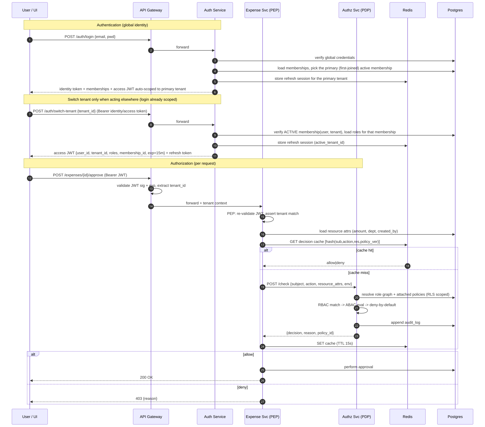

# Diagrams

Rendered from the Mermaid sources in this folder (the same diagrams embedded in
[`../DESIGN.md`](../DESIGN.md)). Each `.mmd` is the source of truth; the `.svg`
(crisp/scalable, best for the PDF) and `.png` (universally embeddable) are generated.

Regenerate after editing any `.mmd`:

```bash
make diagrams        # renders every docs/diagrams/*.mmd to .svg + .png
```

> Rendering uses `@mermaid-js/mermaid-cli` via `npx` (needs Node + a one-time
> headless-Chromium download). The diagrams also render natively on GitHub from
> the fenced ```mermaid blocks in `DESIGN.md`.

---

## 1. High-level architecture — [`DESIGN §5`](../DESIGN.md#5-high-level-architecture)
How the Streamlit UI, Auth, the Authz/PDP, the sample services (each with a PEP),
Postgres+RLS and Redis fit together.



## 2. Multi-tenant membership — [`DESIGN §6.1`](../DESIGN.md#61-multi-tenant-membership-identity-vs-participation)
Identity vs participation: a global `User`, a `Membership` per tenant, roles
hanging off the membership (so one person can hold different roles per tenant).



## 3. Access-control model (RBAC + ABAC) — [`DESIGN §6`](../DESIGN.md#6-access-control-model-rbac--abac)
Users → roles (with inheritance) → permissions, narrowed by ABAC policies, and
the deny-by-default decision pipeline.



## 4. Data model / schema (ERD) — [`DESIGN §7`](../DESIGN.md#7-data-model--schema)
The full relational schema. Global `users`/`permissions`; everything carrying a
`tenant_id` is isolated by Row-Level Security.



## 5. Authentication & authorization sequence — [`DESIGN §8`](../DESIGN.md#8-authentication--authorization-flow)
Global login → select-tenant (tenant-scoped JWT) → a guarded request hitting the
PEP, the decision cache, and the PDP.



## 6. Multi-tenant isolation (defense in depth) — [`DESIGN §9`](../DESIGN.md#9-multi-tenant-isolation-strategy)
The three enforcement layers: token → application → Postgres RLS.



## 7. Service-to-service security — [`DESIGN §10`](../DESIGN.md#10-service-to-service-security)
How services authenticate to the PDP (signed service tokens now; mTLS/SPIFFE as
the production upgrade).


